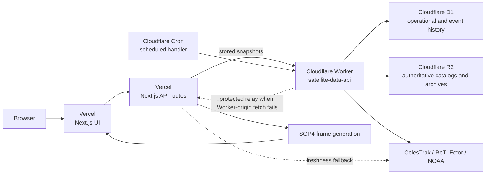

# satellite.agentba.se

An agentic orbital-intelligence experience that turns public space data into an interactive Earth view, close-approach signals, decay monitoring, space-weather context, and local pass predictions.

- Production: [satellite.agentba.se](https://satellite.agentba.se)
- Production data API and health: [satellite-api.agentba.se](https://satellite-api.agentba.se/health)
- Vercel fallback hostname: [satellite-rho.vercel.app](https://satellite-rho.vercel.app)
- Public repository: [Two-Weeks-Team/satellite](https://github.com/Two-Weeks-Team/satellite)

> This service is for education and exploration. Public GP elements contain observation error and update latency. Do not use it for collision avoidance, navigation, or other safety-critical decisions.

## Highlights

- Live active-satellite catalog with SGP4 propagation and smooth GPU-assisted motion
- Interactive 3D Earth with filtering, search, favorites, time controls, and multiple color modes
- Sentinel, Scout, and Sky agent briefings with manual, assist, and autopilot modes
- History-calibrated prediction confidence and persistent risk/decay prioritization
- Close-approach, potential-decay, and NOAA space-weather signals
- Observer-location pass predictions for featured satellites
- English, Korean, and Japanese interfaces
- Stored snapshots and bounded fallbacks when a public upstream is temporarily unavailable

## System architecture

The production system deliberately separates the user-facing runtime from scheduled ingestion and durable data storage.



### Runtime responsibilities

| Component | Responsibility | Must not own |
| --- | --- | --- |
| Browser | Rendering, interaction, language choice, GPU interpolation, user location input | Provider credentials, ingestion secrets, durable history |
| Vercel Next.js | Web UI, public application APIs, SGP4 orbit frames, validation of Worker responses, bounded upstream fallback | Scheduled ingestion, D1/R2 administration |
| Cloudflare Worker | Scheduled ingestion, validation, persistence, archive creation, history aggregation, health reporting | User interface rendering |
| D1 | Ingestion status, event persistence, catalog/history pointers, history metadata | Full active-catalog rows or large source/history payloads |
| R2 | Authoritative raw source payloads, compact catalogs, daily orbital-history summaries | Query-oriented operational state |
| Public sources | GP elements, close-approach candidates, potential-decay data, planetary K-index | Product availability guarantees |

### Read path

1. The browser calls the Vercel application APIs.
2. Vercel reads recent stored data from `https://satellite-api.agentba.se`.
3. The Worker reads query-oriented signals and metadata from D1 and streams authoritative compact catalog payloads from R2.
4. Vercel validates response shape, age, and size before returning it to the browser.
5. If a stored catalog is older than 36 hours, or stored signals are not fully live or are older than six hours, Vercel attempts the public upstreams directly.
6. If all live catalog sources fail, the catalog route returns a small bundled last-known sample and caches the failure for only 30 seconds.

### Write path

1. Cloudflare Cron invokes the Worker's `scheduled()` handler.
2. A run row is created in D1 before upstream work begins.
3. Raw upstream payloads are archived to R2 as they arrive.
4. Parsed signal/event state and snapshot pointers are written to D1 in bounded batches.
5. The authoritative compact catalog and daily history summary are written to R2; full catalog rows are never duplicated into D1.
6. The D1 run row is marked `completed` or `failed`. A completed run can still carry a warning/error message when only part of the signal set succeeded.

## Data sources and scientific boundary

- [CelesTrak GP data](https://celestrak.org/NORAD/documentation/gp-data-formats.php)
- [CelesTrak SOCRATES Plus](https://celestrak.org/SOCRATES/socrates-format.php)
- CelesTrak GP through the ReTLEctor cache as the first catalog source
- [NOAA Space Weather Prediction Center](https://services.swpc.noaa.gov/products/)

Pass predictions are geometric calculations above the configured minimum elevation. They do not account for brightness, clouds, sunlight, local obstruction, or mission-operator data.

The physical trajectory remains SGP4. Historical orbital-element samples never silently move a satellite. They calibrate confidence, stability, persistence, and agent priority around the SGP4 result.

## History intelligence and agent roles

| Agent | Current evidence | How history changes its behavior |
| --- | --- | --- |
| Sentinel | SOCRATES close approaches, potential-decay feed, Kp state | Repeated conjunction/decay observations increase persistence evidence, confidence, and priority |
| Scout | Active catalog, constellation grouping, orbital-element trends | Daily history and orbital stability calibrate pattern confidence and change mapping |
| Sky | SGP4 pass calculations for the observer | Per-NORAD history stability calibrates pass confidence; the pass position itself remains SGP4 |

An object is `collecting` after its first distinct daily catalog sample. It can become `history-calibrated` from the second distinct UTC-date sample. The UI exposes the sample count instead of fabricating a historical baseline.

History is evidence and calibration, not an ML claim. There is currently no learned model that replaces SGP4 or predicts operator-grade collision probability.

## Public API surface

### Vercel application APIs

| Method and path | Purpose | Cache behavior | Authentication |
| --- | --- | --- | --- |
| `GET /api/catalog` | Validated compact active catalog | Live: `s-maxage=7200`; fallback: 30 seconds; matching stale window | Public |
| `GET /api/signals` | Conjunction, decay, and space-weather signals with persistence history | Live: `s-maxage=7200`; fallback: 30 seconds; matching stale window | Public |
| `GET /api/intelligence?norad=...` | Bounded history summary for up to 24 NORAD IDs | `s-maxage=120`, `stale-while-revalidate=300` | Public |
| `GET /api/agent?lat=...&lon=...&norad=...` | Localized, history-aware Sentinel/Scout/Sky briefing | `s-maxage=120`, `stale-while-revalidate=300` | Public |
| `GET /api/orbits?at=...` | Binary SGP4 state frames for the catalog | `s-maxage=25`, `stale-while-revalidate=60` | Public |
| `GET /api/signals?upstream=1` | Raw-source relay used only when the Worker cannot fetch CelesTrak directly | `private, no-store` | Bearer token required |

`/api/orbits` accepts a requested time within plus or minus 48 hours of the server clock and rounds it to a 30-second frame boundary. The response media type is `application/vnd.agentbase.orbit-frame`.

### Cloudflare Worker APIs

| Method and path | Purpose | Authentication |
| --- | --- | --- |
| `GET /health` | Readiness, freshness, latest runs, catalog/event counts, storage ownership, and 24-hour incident counts | Public |
| `GET /api/signals` | Latest fresh D1-backed signals and persistence fields | Public |
| `GET /api/catalog/snapshot` | Latest compact catalog streamed from R2 | Public |
| `GET /api/intelligence?norad=...` | History metadata and bounded per-object intelligence | Public |
| `GET /api/catalog/latest?q=...&limit=...` | Compatibility lookup over the authoritative R2 compact catalog; limit is clamped to 1-100 | Public |
| `POST /internal/ingest?scope=signals` | Manual signal ingestion | Ingestion token required |
| `POST /internal/ingest?scope=catalog&force=true` | Manual/forced catalog ingestion | Ingestion token required |

Worker JSON responses use a short 30-second browser cache. The compact catalog response uses `max-age=120` and `stale-while-revalidate=300`. Error responses use `no-store`.

Manual ingestion accepts either `Authorization: Bearer ...` or `X-Ingestion-Token`. It is disabled when `INGESTION_TOKEN` is not configured. Do not enable it merely for convenience.

## Schedule

Cloudflare Cron expressions run in UTC. Production owns the schedules in `cloudflare/wrangler.jsonc`; Preview has no Cron triggers.

| Scope | Cron | UTC | Asia/Seoul |
| --- | --- | --- | --- |
| Signals | `0 */2 * * *` | Every two hours on the even UTC hour | Every two hours on odd KST hours |
| Catalog and history | `0 18 * * *` | Daily at 18:00 | Daily at 03:00 the following KST day |

The catalog job is idempotent per UTC date unless `force=true` is explicitly used. A same-date scheduled run can therefore return `skipped` without creating another daily history sample.

## Storage model

### D1 resources

| Environment | Database | Purpose |
| --- | --- | --- |
| Production | `satellite-production` | Live signal/history metadata, snapshot pointers, and operational state |
| Preview | `satellite-preview` | Migration and Worker validation without production data mutation or scheduled ingestion |

### D1 tables

| Table | Contents | Lifecycle |
| --- | --- | --- |
| `ingestion_runs` | Run status, timestamps, item counts, archive pointers, warnings/errors | Pruned after 365 days |
| `conjunction_events` | Normalized pair/TCA event with first/last seen, observation count, minimum range, peak probability | Pruned 365 days after last observation |
| `decay_events` | Latest potential-decay state per NORAD ID with first values and observation count | Pruned 365 days after last observation |
| `space_weather` | Retained Kp observations | Pruned after 365 days |
| `catalog_snapshots` | One catalog pointer per UTC date | Not currently pruned by application code |
| `history_snapshots` | Daily history-summary metadata and R2 pointer | Pruned after 365 days |

Schema changes are versioned under `cloudflare/migrations/`. Never edit an already-applied migration; add a new numbered migration and validate it against a fresh local D1 database and Preview first.

### R2 resources

| Environment | Bucket |
| --- | --- |
| Production | `satellite-archive-production` |
| Preview | `satellite-archive-preview` |

Never point either binding at the pre-existing `tiktok-avatars` bucket.

R2 key layout:

```text
signals/YYYY/MM/DD/HHMMSS/
  socrates.html
  decays.json
  space-weather.json
  relay-response.json       # only when the protected relay is used
  snapshot.json

catalog/YYYY/MM/DD/
  active.csv
  active.compact.json
  history.summary.json
```

The history summary is byte-checked before upload and must remain below the application's 4.4 MB validation ceiling. There is no lifecycle or bucket-lock policy declared in this repository; retention configured directly in the Cloudflare dashboard must be documented here when added.

## Freshness, retention, and fallback rules

| Data | Freshness requirement | Durable retention | Failure behavior |
| --- | --- | --- | --- |
| Signals | Every source present and stored snapshot no older than six hours | D1 events/weather and run history: 365 days; R2 source archives: no repository-managed expiry | Vercel fetches public upstreams; partial/offline results cache for 30 seconds |
| Catalog | Stored snapshot no older than 36 hours | D1 keeps daily pointers; R2 is authoritative for daily source/derived files | Vercel tries ReTLEctor, then CelesTrak, then bundled last-known sample |
| Orbital history | Latest summary no older than 36 hours | D1 metadata: 365 days; R2 summaries: no repository-managed expiry | History becomes `unavailable`/`collecting`; SGP4 still uses the available catalog |

## Environment and secret ownership

Never commit `.env*.local`, API tokens, bearer tokens, Wrangler credentials, or copied dashboard values.

| Location | Name | Required | Purpose |
| --- | --- | --- | --- |
| Vercel | `SATELLITE_DATA_API_URL` | Production | Set to `https://satellite-api.agentba.se` so Next.js reads stored snapshots |
| Vercel | `SATELLITE_UPSTREAM_PROXY_TOKEN` | Relay path | Authenticates the Worker's protected upstream relay request |
| Cloudflare Worker secret | `UPSTREAM_PROXY_TOKEN` | Relay path | Must match the Vercel relay token |
| Cloudflare Worker secret | `INGESTION_TOKEN` | No | Enables manual ingestion; leave unset to disable the endpoint |
| Wrangler non-secret variable | `ENVIRONMENT` | Yes | `production` or `preview` response label |
| Wrangler non-secret variable | `ALLOWED_ORIGINS` | Yes | Browser CORS allowlist |
| Wrangler non-secret variable | `UPSTREAM_PROXY_URL` | Relay path | Vercel relay URL; contains no credential |

For local development, `SATELLITE_DATA_API_URL=https://satellite-api.agentba.se` is optional. Without it, Next.js uses the bounded direct-upstream/fallback behavior. Do not copy production secrets into local files unless the task explicitly requires testing the protected relay.

## Tech stack

- React 19 and Next.js 16 application APIs
- Native Next.js frontend and application APIs on Vercel
- Cloudflare Worker ingestion API with D1 operational history and R2 raw archives
- Vinext and Vite scripts retained for the original Cloudflare Worker-compatible Sites build
- `satellite.js` for SGP4 orbital propagation
- D3 Geo, TopoJSON, and Natural Earth-derived world geometry
- TypeScript, ESLint, Wrangler, and Node's test runner

## Local development

Requirements: Node.js 24 and npm.

```bash
npm ci
npm run dev
```

To exercise the application against the stored production snapshots without adding secrets:

```bash
SATELLITE_DATA_API_URL=https://satellite-api.agentba.se npm run dev
```

Cloudflare Preview development selects the Preview configuration but uses local D1/R2 emulators. It also exposes the local scheduled-handler test endpoint:

```bash
npm run cf:dev
```

## Validation gates

Run all gates before requesting review:

```bash
npm run typecheck
npm run lint
npm run cf:check
npm test
```

`npm test` creates a production Next.js build and runs deterministic HTTP tests against a local contract-compatible data API. It verifies the page, live/fallback payload boundaries, localized history intelligence, signals, agent output, binary orbit frames, and protected relay rejection. It does not prove that the current public upstreams or production deployment are healthy; use the smoke checks below for that.

This repository currently has no GitHub Actions workflow. Required automated deployment status comes from Vercel, while the local gates above remain mandatory before merge.

## Project structure

- `app/page.tsx` — interactive orbital experience
- `app/api/catalog/route.ts` — stored catalog reader and bounded upstream/sample fallback
- `app/api/signals/route.ts` — stored signal reader and protected upstream relay
- `app/api/intelligence/route.ts` — bounded history-intelligence proxy
- `app/api/agent/route.ts` — localized Sentinel/Scout/Sky decisions
- `app/api/orbits/route.ts` — binary SGP4 state-frame generation
- `app/orbit.worker.ts` — browser background orbital propagation
- `app/i18n.ts` — English, Korean, and Japanese copy
- `cloudflare/data-worker.ts` — scheduled ingestion, persistence, history, and Worker APIs
- `cloudflare/migrations/` — versioned D1 schema migrations
- `cloudflare/wrangler.jsonc` — Production and Preview D1/R2 bindings, Cron, CORS, logs, and traces
- `lib/history-intelligence.ts` — compact history format and validation
- `lib/catalog-snapshot.ts` — compact catalog format and validation
- `lib/read-response.ts` — bounded response readers
- `tests/runtime.test.mjs` — production-build HTTP contract tests
- `vercel.json` — Vercel framework and reproducible install/build settings
- `worker/index.ts` — retained Cloudflare Worker entry point for the Sites build
- `.openai/hosting.json` — retained OpenAI Sites hosting metadata

## Deployment runbook

The public GitHub repository is connected to the `2weeks-team/satellite` Vercel project. Merges to `main` automatically create production Vercel deployments using `vercel.json`.

### 1. Preflight

```bash
git status --short --branch
npm ci
npm run typecheck
npm run lint
npm run cf:check
npm test
```

Stop if the worktree contains unrelated changes or any gate fails.

### 2. Cloudflare Preview

For additive schema changes, apply migrations before deploying code that requires them:

```bash
npm run cf:migrate:preview
npm run cf:deploy:preview
```

For destructive compatibility migrations such as removing the former D1 catalog table, reverse the order: deploy code that no longer references the table, validate its APIs, apply the migration, and validate again.

```bash
npm run cf:deploy:preview
curl -fsS 'https://satellite-data-api-preview.sgwannabe.workers.dev/health?proof=pre-migration'
curl -fsS 'https://satellite-data-api-preview.sgwannabe.workers.dev/api/catalog/snapshot' >/dev/null
curl -fsS 'https://satellite-data-api-preview.sgwannabe.workers.dev/api/catalog/latest?q=ISS%20%28ZARYA%29&limit=1' | grep -q '"noradId":25544'
npm run cf:migrate:preview
curl -fsS 'https://satellite-data-api-preview.sgwannabe.workers.dev/health?proof=post-migration'
curl -fsS 'https://satellite-data-api-preview.sgwannabe.workers.dev/api/catalog/snapshot' >/dev/null
curl -fsS 'https://satellite-data-api-preview.sgwannabe.workers.dev/api/catalog/latest?q=ISS%20%28ZARYA%29&limit=1' | grep -q '"noradId":25544'
```

Validate the deployment URL reported by Wrangler. Preview intentionally has no Cron, so use local scheduled-handler testing or an explicitly authorized manual ingestion token when ingestion proof is required.

### 3. Review and merge

Open a pull request from a `codex/*` branch. Review the complete diff, resolve valid comments, rerun affected gates, and wait for the Vercel Preview check to pass. Two-Weeks-Team changes use a merge commit unless the maintainer explicitly requests another strategy.

### 4. Cloudflare Production

Worker/D1/R2 changes require an explicit production step after Preview proof. Use migration-first order for additive schema changes. For a destructive migration already proven compatible in Preview, deploy the compatible Worker first:

```bash
npm run cf:deploy:production
curl -fsS 'https://satellite-api.agentba.se/health?proof=pre-migration'
curl -fsS 'https://satellite-api.agentba.se/api/catalog/snapshot' >/dev/null
curl -fsS 'https://satellite-api.agentba.se/api/catalog/latest?q=ISS%20%28ZARYA%29&limit=1' | grep -q '"noradId":25544'
npm run cf:migrate:production
curl -fsS 'https://satellite-api.agentba.se/health?proof=post-migration'
curl -fsS 'https://satellite-api.agentba.se/api/catalog/snapshot' >/dev/null
curl -fsS 'https://satellite-api.agentba.se/api/catalog/latest?q=ISS%20%28ZARYA%29&limit=1' | grep -q '"noradId":25544'
```

Migrations and production deployment are state-changing operations. Confirm the active Wrangler account/profile and exact resource names before executing them. Never apply Preview bindings to Production or Production bindings to Preview.

### 5. Production acceptance

```bash
curl -fsS https://satellite-api.agentba.se/health
curl -fsS 'https://satellite-api.agentba.se/api/catalog/snapshot' >/dev/null
curl -fsS 'https://satellite-api.agentba.se/api/catalog/latest?q=ISS%20%28ZARYA%29&limit=1' | grep -q '"noradId":25544'
curl -fsSI https://satellite.agentba.se/
curl -fsS 'https://satellite.agentba.se/api/intelligence?norad=25544'
```

Then verify in a real browser:

- Default language is English for a new visitor; Auto, Korean, and Japanese remain selectable.
- The live object count and selected NORAD object load.
- History Engine exposes truthful sample and confidence state.
- Selecting a different satellite refreshes per-object history intelligence.
- Risk evidence expands and shows ingestion-cycle persistence.
- 2x, 25x, 100x, and 1000x display controls materially change object size.
- HTTPS, logo favicon, and navigation work.
- Browser console contains no errors or warnings.

Do not call a release complete until local gates, PR checks, production health, and browser verification all pass.

## Observability and health

`cloudflare/wrangler.jsonc` enables Worker invocation logs at 100% head sampling and traces at 1% head sampling. Use Cloudflare **Workers & Pages → satellite-data-api → Observability** for production logs, exceptions, binding spans, and latency.

Useful read-only checks:

```bash
curl -fsS https://satellite-api.agentba.se/health
npx wrangler tail satellite-data-api --config cloudflare/wrangler.jsonc
npx wrangler d1 info satellite-production --config cloudflare/wrangler.jsonc
```

Interpret `/health` as follows:

- `status: ok` requires live signal freshness, fresh catalog/history snapshots, and a clean latest signal run.
- `status: degraded` means one of those current conditions is not satisfied.
- `incidents.failedRunsLast24h` counts failed runs.
- `incidents.partialRunsLast24h` counts completed runs that retained an error/warning because one or more signal sources were missing.
- `database.satellites` is the latest `catalog_snapshots.object_count` compatibility field; it is not a D1 row count. `storage.catalog: r2` identifies the authoritative store.
- Old recovered incidents remain visible for diagnosis but do not make a healthy latest run degraded.

## Incident response

| Symptom | Confirm | Safe first response |
| --- | --- | --- |
| Site is unavailable | Vercel deployment status and `curl -I` | Roll back the Vercel deployment if the last merge caused it |
| `/health` is `degraded` | `freshness`, `latestRuns`, and `incidents` | Identify whether signals, catalog, or history is stale before re-ingesting |
| Signal run is partial | Worker logs and R2 run archive | Allow the next scheduled retry; confirm relay configuration if CelesTrak alone fails |
| Catalog is stale | Latest catalog run, source response, R2 compact object | Confirm upstream availability; run manual ingestion only with explicit authorization |
| History remains `collecting` | `sampleDays` and UTC snapshot dates | Wait for a second distinct daily catalog snapshot; do not force fabricated samples |
| Manual ingestion returns 401 | Whether `INGESTION_TOKEN` is intentionally configured | Keep disabled unless a controlled maintenance task requires it |
| Worker returns CORS 403 | Request `Origin` and `ALLOWED_ORIGINS` | Add only the exact required production origin through reviewed configuration |
| UI works but console reports errors | Browser console plus failing API request | Fix the product/API issue and repeat the production browser smoke test |

## Rollback and recovery

### Vercel

Use the Vercel deployment page to promote the last known-good production deployment. A Vercel rollback does not roll back Cloudflare Worker code or D1 schema.

### Worker

Inspect current deployments before changing state:

```bash
npx wrangler deployments list --config cloudflare/wrangler.jsonc
```

Use Wrangler's rollback flow only after selecting the exact prior Worker version and confirming compatibility with the current D1 schema. Worker rollback cannot undo an applied D1 migration.

### D1

D1 Time Travel is the point-in-time recovery mechanism. First inspect the database version and bookmark without changing state:

```bash
npx wrangler d1 info satellite-production --config cloudflare/wrangler.jsonc
npx wrangler d1 time-travel info satellite-production --config cloudflare/wrangler.jsonc
```

A Time Travel restore overwrites the database in place and cancels in-flight queries. Never run a restore from an automated script or without explicit approval, an exact timestamp/bookmark, a current bookmark recorded for undo, and a post-restore verification plan. Retention depends on the current Workers plan; consult the official D1 Time Travel documentation rather than assuming a fixed window.

### R2

R2 contains the source and derived audit trail, but this repository does not configure versioning, lifecycle rules, or bucket locks. Treat object deletion and lifecycle changes as destructive operations. Recovery normally uses a validated archived object plus a reviewed D1 pointer repair or a fresh ingestion; never overwrite the production pointer speculatively.

## Security and operational boundaries

- The browser receives no ingestion or relay credentials.
- CORS is an allowlist, not authentication. Server-to-server reads without an `Origin` remain possible for public endpoints.
- The upstream relay and manual ingestion endpoints use separate secrets and `no-store` responses.
- Source responses are read with explicit timeout and byte ceilings before parsing.
- Requested history intelligence is capped at 24 NORAD IDs per request.
- Compatibility catalog search reads the validated R2 compact snapshot and is capped at 100 results.
- The R2 history summary has a 4.4 MB application ceiling.
- Do not commit `.env*.local`, Wrangler profiles, Cloudflare tokens, Vercel tokens, or dashboard exports containing secrets.
- Do not use this service or its confidence scores for operational conjunction assessment or spacecraft control.

## Retained Sites build and rollback path

Vinext/Vite and the original OpenAI Sites-compatible metadata remain in the repository as a separate build path:

```bash
npm run build:sites
npm run start:sites
```

This path is not the active production frontend. Do not change `origin`, delete the `sites-source` remote, or point the retained Sites Worker bindings at the production data resources without a separate migration plan.

## Documentation maintenance rule

Update this README in the same pull request whenever any of the following changes:

- Public or internal API path, auth, cache, timeout, or payload contract
- Vercel environment variable or Worker secret
- Cron expression or scheduled scope
- D1 table, migration, retention rule, or resource name
- R2 bucket, key layout, lifecycle, or archive format
- Health semantics, observability sampling, deployment gate, or rollback procedure
- Agent role, history-calibration meaning, scientific limitation, or production hostname

## Official platform references

- [Cloudflare Workers Cron Triggers](https://developers.cloudflare.com/workers/configuration/cron-triggers/)
- [Cloudflare Workers observability](https://developers.cloudflare.com/workers/observability/)
- [Cloudflare D1 migrations](https://developers.cloudflare.com/d1/reference/migrations/)
- [Cloudflare D1 Time Travel](https://developers.cloudflare.com/d1/reference/time-travel/)
- [Cloudflare R2 documentation](https://developers.cloudflare.com/r2/)
- [Vercel Next.js documentation](https://vercel.com/docs/frameworks/full-stack/nextjs)
